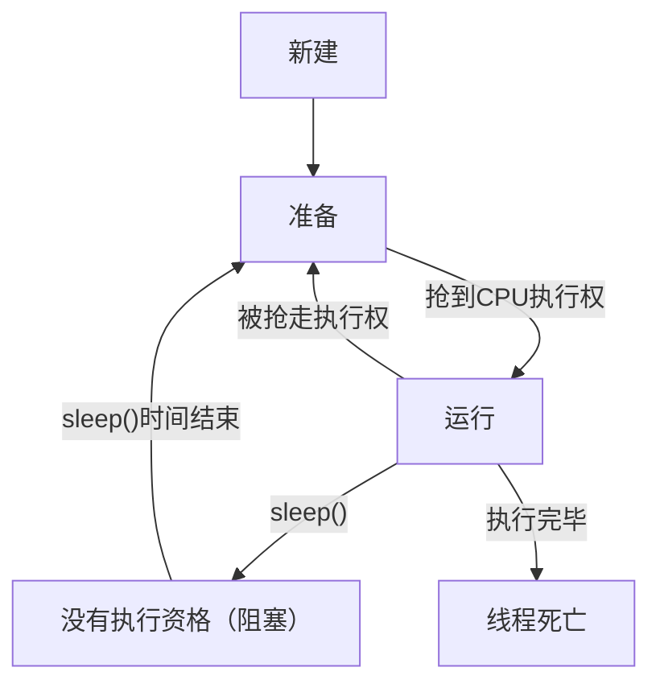
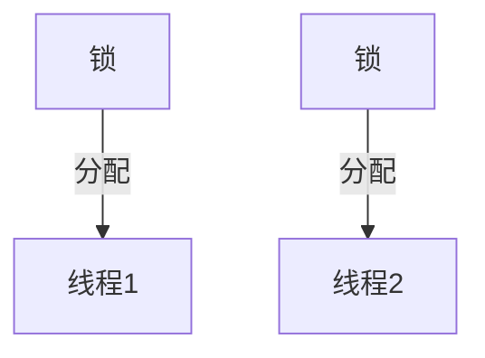
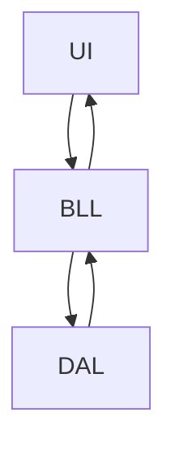

__<font color = "Orange">1.我正在学什么</font>__
__<font color = "Orange">2.存在的意义是什么</font>__
__<font color = "Orange">3.知道什么东西用什么工具做</font>__
__<font color = "Orange">4.要会提出解决方案</font>__


# API
https://docs.oracle.com/en/java/javase/21/docs/api/index.html
## String
(1)字符数组转字符串
    char[] chs = {'a','b','c'}
    String a = new String(chs)
    //a -> "abc"
__(2)字符串比较__
"=" 比较数值值
"equals/equalsIgoreCase" 比较地址值(时候忽略大小写)

### StringBuilder
提高字符串的操作效率

```java
    //创建容器
    StringBuilder sb = StringBuilder()
    StringBuilder sb = StringBuilder("abc")

    //方法
    .append()   添加
    .reverse()  反转
    .length()  
    .toString()
```

### StringJoiner

```java
    StringJoiner sj = StringJoiner("间隔符号")
    StringJoiner sj = StringJoiner("间隔符号","开始符号","结束符号")
    //间隔是两添加的字符之间添加
```

## math
```java
    abs()   //绝对值
    cell()/floor     //向上/向下取整
    max(int a ,int b)
    pow(dooub)
    .sqrt()     平方
    .cbrt()     立方
```
## System

```java
    .exit(int status)       //终止当前虚拟机 0正常停止 非零异常停止
    .currentTimeMillis()       //返回当前系统时间的毫秒形式
    .arraycopy(数据源数组，起始索引，目的地数组，起始索引，拷贝个数(a中数组中的个数))        //数组拷贝
```
## Runtime

```java
    .getRuntime()       //通过方法new一个

    .exit()
    .availableProcessors()       //获取CPU线程数
    .maxMemory()        //jvm能从系统中获取的总内存
    .totalMemory()      //jvm已经从系统中获取的总内存
    .freeMemory()       //jvm剩余的内存
    .exec(String command)       //运行cmd命令
```


## Object

```java
    .toString()
    .equals()
    .clone(int a)       //对象克隆
        >浅克隆//深克隆  （是否新创建对象-浅克隆更改一个两个都修改）
    
    .BigInteger     //获取最大整数
    .BigDecima      //创建精确的小数
```
## 正则表达式 

(1)校验字符串是否满足一定的条件
(2)获取文本中的内容
例子：
    检验qq号码是否正确（6~20位以内，0不能在开头，必须全是数字）qq.matches("[1~9]\\d{5,19}")

* <font color = "orange">使用规范</font>

        [abc]   只匹配a,b或c;
        [^abc]  除了a,b,c之外任意字符；
        [a-zA-Z]    a到z A到Z,包括(范围)；
        [a-d[m-p]]  a到z,或m到p;
        [a-z&&[def]]    a-z和[d,e,f]的交集
        [a-z&&[^ba]]    a-z和非bc的交集；
        [a-z&&[^m-p]]   a-z和除了m-p的交集；


    预定义字符(只匹配一个字符)

        .       任何字符;
        \d      一个数字[0-9]范围;
        \D      非数字：[^0-9];
        \s      一个空白字符[\t\n\xOB\f\r]      //制表空白等
        \S      一个非空白字符：[^\s];
        \w      [a-zA-Z_0-9]英文、数字、下划线；
        \W      [^\w]一个非单词字符

        多次判断
        X?      X,出现一次或0次；
        X*      X,0次或多次；
        X+      X,一次或多次；
        X{n}    X,正好n次；
        X{n，}  X,n次到无穷；
        X{n,m}  X,n到m次；


## 时间类

1 s = 1000 ms
1 ms = 1000 微秒
1 微秒 = 1000 纳秒

* Date类
  * ZoneId：时区
  * Instant:时间戳
  * ZoneDaTeTime：带时区时间
  
* SimpleDateFormat类（日期格式化）
  * DateTimeFormatter

* Calender：日历类
  * LocalDate：年月日
  * LocalTime：时分秒
  * LocalDateTime：年月日时分秒
  
* 工具类（获取值）
  * Duration：时间间隔（秒，纳秒）
  * Period：时间间隔（年月日）
  * ChronoUnit 时间间隔（所有单位）

## 包类
把基础的数据包装成类
* Integer
* Charater
* String


***
# 数组
## Arrays 数组工具类

    Arrays.toString(int[] a)            //数组转成一组字符串

    Arrays.binarySearch(int[] a, key)   //二分查找
    //数组元素必须升序
    //查找数据存在 返回真实索引   否则返回插入点减一

    Arrays.copyOf(int[] a , newLength) //复制数组
    //如果oldLength < newLength 补上默认值
    // = 正差拷贝
    // > 部分拷贝

    Arrays.copyRange(int[] a , from , to) 
    //包头不包尾

    Arrays.sort(int[] a)              //排序，默认升序

    <font color = "blueeer">实现方式:</font>
    Arrays.sort(int[] a , new Comparator<Integer>){
        @Override
        public int compare(Integer o1 , Integer 02){
            return o1 - o2 (升序)/return o2 - o1 降序
        }
    }
<font color = "#BBFFFF">通过把数组分成两块 有序(0索引)和无序(其他索引)
(1)核心逻辑是将无序数组中的元素插入到有序数组中，通过>= 和 < 判断放在左还是右
(2)刚开始有序只有0索引 添加后遍历次数也会增加
</font>

***
# 函数对象

***
# 封装

***
# 继承

***
# 多态

## 使用方法
    public void register(Person p){
        p.show()                   
    }                              
继承Person类的子类都可以通过赋值给Person p 调用对应的show方法

## 条件
1.有继承关系
2.有父类引用指向子类对象
3.方法重写

## 多态方式调用成员变量和方法

1.编译看左边，运行也看左边(成员变量)————直接看父类的变量
2.编译看左边，运行也看右边(成员方法)————子类重写覆盖父类

多态创建对象 “父类” 父类名 = new “子类”

## <font color = "orange">静态代码块</font>
```java
static{
    ....
}
```
在类首次被调用时创建

用途：
- 线程池，数据库连接池管理 ->只在首次需要时创建一个集中管理的类
    
## <font color = "orange">泛型</font>
<font color = "lightyellow">Java 泛型主要用于解决 类型系统（Type System） 的问题：如何在不丢失类型安全的前提下，编写可处理多种数据类型的通用代码</font>


任意类型（不确定类型）-> T 表示
- 变量在第一次使用时，根据赋值对象类型改变
  ```java
  private T a;

  a = 1 此时 T -> int 类型
  ```

## 优缺点
1.优点
   
（1）利于维护
__<span style="color:red">（2）调用方法时可以传递所有的子类对象</span>__
    2.缺点
    <font color = "orange">（1）方法调用时，无法调用子类的特有方法，因为编译时会先检查父类中是否有这个方法。</font>


***
# 抽象
强制子类按照这种格式写（在多人开发中可以使得不同的人能够用同意的格式进行，方便阅读合作）

## <font color = "orange">接口</font>
抽象方法的集合体————只写方法（一种规则）
继承的同时依然可以实现接口
<font color = "red"> 接口重名：重写一次就全部重写</font>

* <font color = "ornange">作用</font>
  * 实现不同类在调用时，可以通过同一个方法名称调用自己的方法: -> 实现多态

```java
    //接口
    public interface IPaymentMethod {
        void processPaymentMethod(double amount);
    }

    //支付，处理用户支付
    public class PayPalProcessor {
        public void processorPayment(IPaymentMethod paymentMethod , double balance) {
            paymentMethod.processPaymentMethod(balance);
        }

    }   

    //接口
    public class PayPalPaymentMethod implements IPaymentMethod{
        @Override
        public void processPaymentMethod(double paymentAmount) {
            System.out.println("PP payment : " + paymentAmount);
        }
    }
    public class CreditCardPaymentMethod implements IPaymentMethod{
        @Override
        public void processPaymentMethod(double paymentAmount) {
            System.out.println("Cred payment : " + paymentAmount);
        }
    }
    //实现
    public class test {
        public static void main(String[] args) {
            PayPalProcessor pp = new PayPalProcessor();
            pp.processorPayment(new CreditCardPaymentMethod(),1000);
            pp.processorPayment(new PayPalPaymentMethod(),1000);
        }
    }

```
### 接口中的成员

成员变量：默认修饰public static final
构造方法：无
成员方法：都行


***
# 内部类
定义：在类的内部在创建一个类
<font color = "green">内部类是外部类的一部分，单独出现作用不大</font>

1.内部类可以访问外部类属性
2.外部类不能直接访问外部内部类熟悉（只能同过创建对象进行访问）
    
## 成员内部类
<font color = "red">Outer 表示外部类名 Inner 表示内部类名</font>
类中方法外
1.先创建外部类实例
2.创建内部类对象 ：  ”外部类“."内部类" “类名” = "外部类实例".new "内部类"
3.内部类调用外部类成员变量 外部类名.this.a

## 静态内部类
1.特点：只能访问外部类中静态方法和变量（创建对象后除外）
2.创建 Outer.Inner “名称” = new Outer.Inner()

## 局部内部类
1.定义在方法中
2.外界无法直接访问，需要在方法中创建使用
3.该类可以直接访问外部类成员，也可以访问方法内的局部变量

## <font color = "orange">匿名内部类 </font>
1.（1）创建 new 类名或接口 -> 实现/继承 接口/类
  （2）方法重写
  （3）创建对象
2.类名不可见
<font color = "gree">3.简化代码 减少子类文件的创建
4.创建即可调用 new (){}.("调用方法")</font>

## lambda表达式
* 简化匿名内部类书写（不关心谁做，关心做什么）
(1)组成：参数部分+逻辑表达 
    (int a , int b) -> a + b
    (方法参数) -> (方法)
(2)简化代码，使得代码逻辑更好读懂


***
# 集合

## 顶层接口Collection
* <font color = "orange">方法</font>
    (1)public booleam add(E e)      //添加 <font color = "pink">(set 添加失败会放回false)</font>

    (2)public void clear()          //清空

    (3)public boolean remove(E e)      //删除

    (4)public boolean contain(E e)  //判断元素是否存在

    <font color = "red">底层实现是通过equals()方法实现，如果要判断自定义类需要重写底层equals方法</font> --Alt + Insert 重写快捷建

    (5)public boolean isEmpty()     //是否为空

    (6)public int size()            //获取长度
|
|
* <font color = "orange">迭代器遍历</font>
    Iterator<E> "名称" = iterator() 创建迭代器(默认指向0索引)
    (常用方法)
    * (1)hasNext();
        有元素返回true
    * (2)next()
        先获取元素，再往后移动指针

    (特点)  
    1.不依赖索引

    2.指针不会复位 --只能重新获取

    3.next()不能多次使用？？————原因hasnext()判断无法跟上移动指针的速度

    4.<font color = "red">迭代器遍历</font>不能用集合的方法进行增加或删除
    
    * for 增强语句简化迭代器

|

* <font color = "orange">泛型</font>
  (1)用于规范数组的书写，没有泛型默认所有数据都是Object,获取数据无法使用特有行为
  (2)泛型中不能写基本数据类型
  (3)泛型类不具备继承性，但数据具备继承性 <font color = "pink">（方法传递不能传递子类）</font>
  <font color = "red">(4)通配符 ？限定范围(继承体系常用)</font>
|
|
* __<font color = "orange">泛型类</font>__
当类中有数据类型不确定——>定义泛型类(类名+<E_> E记入类型 )

    
        public static class myList<E>{
        Object[] array = new Object[10];
        int size;

        public boolean add(E e){
            array[size] = e;
            size++;
            return true;
        }

        public E get(int index){
            return (E) array[index];
        }

        @Override
        public String toString() {
            return Arrays.toString(array);
            }
        }

***

* __<font color = "orange">泛型方法</font>__
方法中形参不确定，可以使用方法后定义泛型

        public static class oya{
            private oya(){}

        public static<E> void addAll(List<E> list , E...e){
            list.add(e);
            list.add(e1);
            list.add(e2);
            list.add(e3);
            }
        }

|
|

* __<font color = "orange">泛型接口</font>__
(1)实现类给出具体的类型 --直接通过接口规范可存储类型--如果不确定可以延续泛型

### List
* __<font color = "blac">(1)特点：有序、可重复、有索引</font>__

* ArrayList类
* LinkedList类
#### ArrayList
#### LinkedList
(特点)
底层数据结构：双向链表、查询慢、增删快、操作首尾元素速度快

#### Vector

### Set
__<font color = "blac">(1)特点：无序、不重复、无索引</font>__
(2)给HashSet中存放自定义类型元素时，需要重写对象中的hashCode和equals方法，建立自己的比较方式，才能保证HashSet集合中的对象唯一

#### HashSet

* hashCode方法：
  * 不同对象计算的整数不同（根据地址计算）
  * 如果重写：一样属性的对象（类）返回的值相同；
  * </font color = "yellow">存储类对象时要重写.equals和.hashCode方法（Alt + Inster）</font> 
##### LinkedHashSet
#### TreeSet

### Map
(与Python 中的元组很类似)
(1)表中的一个元素 a 分成 key(键值) + (隐藏值) ——> 同过键值可以查找找隐藏值
(2)HashMap<K,V>：存储数据采用的哈希表结构，元素的存取顺序不能保证一致。由于要保证键的唯一、不重复，需要重写键的hashCode()方法、equals()方法。

主要方法:
(1)get(Object key)    
(2)put(K key,V value)   
(3)remove(Object key)

# I/O
## File/Dir

<font color = "red"> 绝对路径：带盘符(C:)
相对路径：不带盘符</font>

* __<font color = "orange">判断/获取的方法__</font>
  
        .isDirectoty()  //是否文件夹 true OR false
        .isFile()
        .exists()

        .length()
        .getAbsolutePath()
        .getPath()
        .getName()
        .lastModified()  //返回时间

        .createNewfile() //创建文件 1.不存在返回ture 不存在创建失败false 2.一定创建文件
        .mkdir()/.mkdirs  // 1.路径唯一
        
        .delect() //文件直接删 目录有内容删除不了

        .listFiles();       //获取文件夹中所有内容

* <font color = "yellow">换行和续写</font>
    
    增加换行符\r\n；
    打开续写开关，构造函数的第二个变量；

* __<font color = "orange">成员的方法__</font>   

        .listRoots()(static)        //打印盘符
        .list()                     //文件夹下所有文件的获取名字
        .list(FileFilter fileter)       //利用文件过滤(函数方法接口！！) 返回值File
        .list(FilenameFilter fileter)       //返回值String

## I/O流
### 字节流（可以非纯文本，可拷贝所有数据）

__<font color = "orange">FileOutputStream fos = new FileOutputStream(路径)</font>__
    
    .getBytes()     //String -> 字节数组
    .write()写      //会清空文件夹
    .wirte(byte[] b)
    .write(byte[] b,int begin , int len)

__<font color = "orange">FileInputStream fos = new FileOutputStream(路径)</font>__

    .read() //读取编码，用整数接受；
    循环读取：
    int b;
    while(b = fis.read() != -1){
        System.outprintln((char)b)      //编码转化成字符
    }

<font color = "orange">文件拷贝</font>
* 小文件

        int b;
        while(b = fis.read() != -1){
            fos.write(b)      //编码转化成字符
        }

* 大文件

        byte[] bytes = new byte[2];     //bytes的长度决定一次读取多少个数据;
        int len 
        while((len = fis.read(bytes)) != -1){       //读取bytes个数据存储到len中
            fos.write(bytes,0,len)
        }
#### 字节高级流

把基本流包装成高级流

* 字节缓冲流

### 字符流（编码读取异常导致读取数据乱码问题）

* 未读完整个汉字
* 编码和解码使用的方法不同

        FileReader fdr = new FileReader();
        FileWiter ftr = new FileWriter; 


<font color = "yellow">因为字符流有缓冲区，所以新写入的字符无法马上被读取，需要手动刷新</font>

        // 使用 try-with-resources 自动管理资源
        try (FileWriter fw = new FileWriter(text1);
             FileReader fr = new FileReader(text1)) {
    
            fw.write("我还会");
         // 不需要显式调用 flush() -->flush 作用是使得文件中内容处于最新的状态
            // try-with-resources 会在关闭时自动刷新
    
            // 现在可以正常读取
            int ch;
            while((ch = fr.read()) != -1) {
                System.out.print((char)ch);
            }
}

***

### 高级流

<font color = "yellow">用于包装基本流</font>

#### 字符缓冲流

        BufferedReader(new FileReader r)
        BufferedReader(new FileWiter w)

        特有方法：
        读取：
        readLine()  //读一行数据，没有了返回null
        输入L:
        void newLine() //跨平台换行


#### 转换流

* InputStreamReader 字节输入流转成字符输入流
* OutputStreamWriter 字符输出流转成字节输出流

* 特点：在字节流->字符流->缓冲流 中加入参数可以

* <font color = "yellow">jdk11后字符流可直接指定编码</font>

#### 序列化流

把java中的对象写入到本地文件中；
* ObjectInputStream 
* ObjectOutputStream


记录到本地文件后修改：
  * 系统会自动计入一个版本好，如果修改，版本号会随之更新（serialVersionUID）

方法：

1.自己定义为final
2.通过底层修改Serializable的效果自动固定版本号

只序列化部分熟悉：

* 加入transient 关键字


#### 打印流

1.字节打印流
* 特点
  * 只有写没有读
  * 只操作文件的目的地，不操作数据源
  * 具有特别的写法，可以实现数据的原样写出;
  * 特有方法：打印一次 = 写出 + 换行 + 刷新;

2.字符打印流


#### 解压/压缩流

解压缩流：

        public static void unzip(File scr,File dest) throws IOException {
            ZipInputStream zis = new ZipInputStream(new FileInputStream(scr));
            ZipEntry ze;

            while ((ze = zis.getNextEntry()) != null) {
                if (ze.isDirectory()) {
                    File newFile = new File(dest, ze.toString());
                    newFile.mkdirs();
                }
                else {
                    FileOutputStream fos = new FileOutputStream(new File(dest, ze.toString()));
                    int b;
                    while ((b = zis.read()) != -1) {
                        fos.write(b);
                    }
                    fos.close();
                    zis.closeEntry();
                }
            }
            zis.close();
        }

# 多线程

* <font color = "red">多个线程抢夺cpu的执行权达到多线程的效果</font>

* 作用：
  * 同时做多件事
  * 提高运行效率

* 并发和并行
  * 并发：同一时刻，多个指令在单个CPU上交替执行
  * 并行：同一时刻，有多个指令在多个CPU上同时执行

## 实现方式
  * 重写run方法
    * 继承Threat
    * 实现Runable -> (<font color = "yellow">需要创建线程对象并传递继承接口的类对象</font>)
  * 可以获取多线程运行结果
    * 继承Callable接口 
      * 创建一个类
      * 重写call（具有返回值）
      * 创建类对象（表示执行任务）
      * 创建FutureTask（作用管理多线程的运行结果） 
      * 创建Threat（用于启动线程）
    * <font color = "yellow">需要不同线程的运行结果时使用</font>
* <font color = "yellow">区别</font>
  * 继承Threat：创建多个对象去分配到多个线程
  * 实现Runable：创建一个类，可以放到不同的线程中；

## 常见方法

        
        getName 线程名 -> 构造方法取名需要重写方法
        setName
        Thread currentThread()获取当前线程
        sleep(long time)指定线程的休眠时间ms
        setPriority(int newPriority)设置线程优先级
        getPriority()
        setDaemon(boolean on) 设置是守护线程 -> 在非守护的线程结束后守护线程就会陆续结束
        yield()出让线程/礼让线程 -> 让出当前线程的执行权
        join()插入线程  -> 插入到当前线程之前
        --------
        //方法一
        MyThreat myThreat1 = new MyThreat();
        MyThreat myThreat2 = new MyThreat();

        myThreat1.setName("X1");
        myThreat2.setName("X2");

        myThreat1.setPriority(1);
        myThreat2.setPriority(2);

        myThreat1.setDaemon(true);

        myThreat1.start();
        myThreat2.start();

        String name = myThreat1.getName();
        System.out.println(name);

        Thread tt = Thread.currentThread();
        String name2 = tt.getName();
        System.out.println(name2);

        Thread.sleep(5000);
        System.out.println(tt.getName());

## 线程的生命周期


## 线程安全

* <font color = "Orange">用处</font>
  * 可以通过锁，创建区域来解决同一时间多用户注册统一账号的问题;

### sychronized

* 锁对象"任意" ：synchronized(对象)锁 （功能：把一个代码锁起来）
  * 对象:唯一的
  * 几个线程运行同一个代码;
  * <font color = "yellow">上锁后：不同的人用一个公共设施，排队进行</font>

* 锁方法（同步方法）-继承;
  * 把方法上锁；
  * 优点;
    * 可以添加不同的方法到锁中
    * 增加可读性

### lock（使用范围比sychronize更广泛）

## 等待和唤醒

* 方法作用：处理有限空间内添加和取出的控制
* 特点：<font color = "yellow">
  * 解锁和唤醒是在同一个对象上对象的
  * 同一个锁可以接受或发出它锁定的对象的指令</font>
  * 不同的锁之间的对象无法进行唤醒和等待；(a无法操作线程2，除非获得线程二的锁)


* 两个锁的问题
  * 可能会浪费资源
  * 造成死锁 
    >1在线程A中上锁,并请求线程B
    >2在线程B中上锁，并且请求A
    ```java
        public class MyThreat2{
            static int Count = 10;
            static int food = 0;
            static final Object lock1 = new Object();
            static final Object lock2 = new Object();
        }

        public class MyThreat extends Thread {
            public void run() {
                while (true) {
                    synchronized (MyThreat2.lock2) {
                        if (MyThreat2.Count == 0) {
                            break;
                        }
                        if (MyThreat2.food != 0) {
                            // 必须先获取 lock1 的锁才能调用 notifyAll()
                            synchronized (MyThreat2.lock1) {
                                MyThreat2.lock1.notifyAll();
                            }
                        }
                        if (MyThreat2.food == 1) {
                            try {
                                MyThreat2.lock2.wait(); // 持有 lock2 的锁，可以 wait()
                            } catch (InterruptedException e) {
                                throw new RuntimeException(e);
                            }
                        } else {
                            MyThreat2.food++;
                            System.out.println("生产了" + 1 + "个");
                            System.out.println("等待运输的" + MyThreat2.food + "个");
                        }
                    }
                }
            }
        }

    public class MyThreat1 extends Thread {
        @Override
        public void run() {
            while (true) {
                synchronized (MyThreat2.lock1) {
                    if (MyThreat2.Count == 0) {
                        break;
                    }
                    if (MyThreat2.food == 0) {
                        try {
                            MyThreat2.lock1.wait(); // 持有 lock1 的锁，可以 wait()
                        } catch (InterruptedException e) {
                            throw new RuntimeException(e);
                        }
                    } else {
                        System.out.println("可以运输的" + MyThreat2.food + "个");
                        MyThreat2.Count--;
                        MyThreat2.food--;
                        System.out.println("还差" + MyThreat2.Count + "个");
                        System.out.println("运输了" + 1 + "个");
                    }
                }
                // 在 lock1 的同步块外，获取 lock2 的锁并唤醒生产者
                synchronized (MyThreat2.lock2) {
                    MyThreat2.lock2.notifyAll();
                }
            }
        }
    }
    ```

### 阻塞队列
ArrayBlickingQueue;
LinkesBlockingQueue;

## 线程池
newCachedThreadPool()
newFixedThreatPool(int nThreat)

* 自定义线程池
  * 核心线程数
  * 线程池中最大线程数量
  * 空闲时间（值）（计算临时线程存在时间）
  * 空闲时间（单位 s/m/h）
  * 阻塞队列（超出最大值）
  * 创建线程方式
  * 执行过多任务时的解决方案

* 线程池多大合适
  * CPU密集性： 最大并行数+1
  * I/O：密集性： 最大并行数 * CPU利用率 * 总时间(CPU计算+等待)/CPU计算时间

* 特点：
 * 节约线程资源（用已经存在于线程池中的线成去完成提供的任务）

## ThreadLocal

1.解决多并发问题，用于存储用户连接，防止同一个线程不停获取不同的连接导致资源浪费

2.threadlocal：可以存储保存并且识别某个线程的共享变量，类似于map

# 网络编程

* 类别
  * CS 客户端 + 服务器
  * BS 浏览器 + 服务器

* 三要素
  * IP（上网设备表示）
  * 端口号（应用在上网设备中表示）
  * 协议（数据传输规则）

## 协议

* TCP/IP
  * 应用层
  * 传输层
  * 网络层
  * 物理链路层

* UTP
  * 用户数据报协议
  * 面向无连接通信协议（能收就收，收不到就扔）
  * 优点：
    * 速度快
  * 缺点：
    * 数据有大小限制（最多64kb）
    * 数据不安全，易丢失
* TCP
  * 面向连接（连接后才传输，确保收到
  * 特点相反；


## 传输数据

### UTP
* DatagramSocket (运输)
* DatagramPacket (打包数据)
* 发送

* 传输模式
  * 单播
  * 组播（224.0.0.1）
  * 广播（255.255.255）

### TCP

* ServerSocket -><font color = "yellow">用来确认服务端，保证连接</font>
  * 服务端关闭程序才会结束；
  * 多线程：每接收一个客户都可以调用线程池
* Socket -> <font color = "yellow">类似于桥梁，用于获取流来相互传递信息</font>
  * <font color = "white">通过不断的获取连接可以不停的向服务端输出文件，消息</font>


# 动态代理

* 定义：在不修改原有代码的情况下，在代码中增加额外的功能；
* 代理：做完额外功能后，调用被代理对象的方法的；
  * 需要代理实现创建的接口类（接口中记录需要代理的方法）
  * 创建代理对象：实现同一个接口；

* <font color = "Orange">注意点：
  * 只能代理类实现的接口方法
  * 接口不能是Final类；（相当于没有代理）
  * 不能在代理方法中继续代理；</font>

```java
        public static Methon createProxy(Student stu){

                //参数1：用于指定用哪个加载器，去加载生成代理
                //指定接口，这些接口用于指定代理内容
                //用代理生成，生成代理做什么的代码

                //创建代理对象方法
                Methon proxy = (Methon) Proxy.newProxyInstance(
                        DL.class.getClassLoader(),
                        new Class[] {Methon.class},
                        
                        //代理要运行的方法
                        new InvocationHandler() {
                            @Override
                            //参数，1.代理对象2.要运行的方法名称3.运行需要用到的参数
                            public Object invoke(Object proxy, Method method, Object[] args)throws Throwable {
                                if (method.getName().equals("sing")) {
                                    System.out.println("准备话筒" + "收钱");
                                }
                                else if (method.getName().equals("dance")) {
                                    System.out.println("准备舞台" + "收钱");
                                }
                                //调用对象的方法
                                method.invoke(stu, args);
                                return null;
                            };
                        });
                return proxy;
            }
```

# 图形化界面

* 界面设置样例
```java
    public class GameFrame extends JFrame {

        public GameFrame(int width, int height, String title) {
            initFrame(width, height, title);

            initJMenuBar();

            //设置是否可见
            this.setVisible(true);
        }

        private void initJMenuBar() {
            //创建菜单
            JMenuBar menuBar = new JMenuBar();

            //菜单上的功能
            JMenu functionMenu = new JMenu("功能");
            JMenu aboutMenu = new JMenu("关于我们");

            //选项下的条目对象
            JMenuItem replayItem = new JMenuItem("重新开始");
            JMenuItem reLoginItem = new JMenuItem("重新登录");
            JMenuItem closeItem = new JMenuItem("关闭游戏");

            JMenuItem aboutItem = new JMenuItem("???");

            //组合条目
            functionMenu.add(replayItem);
            functionMenu.add(reLoginItem);
            functionMenu.add(closeItem);

            aboutMenu.add(aboutItem);

            //添加到菜单
            menuBar.add(functionMenu);
            menuBar.add(aboutMenu);

            //添加到界面
            this.setJMenuBar(menuBar);
        }

        private void initFrame(int width, int height, String title) {
            //设置长宽
            this.setSize(width, height);
            //设置标题
            this.setTitle(title);
            //设置是否总是置顶
            this.setAlwaysOnTop(true);
            //设置界面居中
            this.setLocationRelativeTo(null);
            /*
            设置默认的关闭模式（点×关闭）
            0:关闭什么都不做(窗口也不会关闭)
            1:默认
            2:多个界面只有最后一个关闭才停止程序（所有界面都得是2）
            3:关闭界面程序结束
            */
            this.setDefaultCloseOperation(WindowConstants.EXIT_ON_CLOSE);
        }
    }
```
* 图片管理
  * ImageIcon -> 获取图片对象
  * JLabel -> 图片的管理容器
  * 获取窗口getContentPane
  * 添加到窗口中
  * 图片坐标 （以左上角为原点构建的坐标系）

* 事件


# 项目开发

* 继承：可以使得创建的类拥有java自带的属性； -> 使得可以提取统一属性（只在要用时创建对应的需求）

## 设计思想

### SOLID设计原则

* 单一职责原则
* 开放封闭原则
* 里氏封闭原则
* 接口隔离原则
* 依赖倒置原则

#### 单一职责原则

定义:
* 每个类只有一个引起变化的原因 -> 及一个类只承担一个职责:
* 多职责的弊端:
  * 当一个类承担多个不相干的功能时，一个功能损坏导致所有功能不能使用
  * 多个功能会增加代码的复杂度和可读性！！！
  * 多个功能会降低代码的可拓展性；

职责：
* 某一个事件需要内部数据改变 -> 处理某一类/某个事件
* 多个职责：多个事件都需要调用这个职责管理的功能；

#### <font color = "Orange">开放封闭原则</font>

定义：
* 软件实体应该对扩展开放对修改封闭:
* 在更改原有代码的情况下，增加方法来实现功能的拓展；

* 扩展的功能由新的类承担，在旧类中只需要实现接口就行；

```java
    //不遵循原则
    public class PaymentProcessor{
        public void processPayment(String type, double amount){ //判断支付方式
            if ("信用卡".equals(type)){
                ...
            }
            else if ("支付宝".equals){
                ...
            }

            //如果要增加支付方式的话只能增加if语句修改代码 -> 违反原则
        }
    }


    //遵循原则
    public interface IPaymentMethod{
        void processPayment(double amount);
    }

    public class PaymentProcessor{
        public void processPayment(IPaymentMethod paymentMethod,double amount){
            paymentMethod.processPayment(amount);
        }
    }

    //只需要增加新的类实现IPaymentMethod接口
    public class CreditCardPayment implements IPaymentMethod{
        @Override
        publrc void processPayment(double amount){
            ...
        }
    }

    public class PayPalPayment implements IPaymentMethod{
        @Override
        publrc void processPayment(double amount){
            ...
        }
    }
```
####  里氏封闭原则

定义:
* 子类因该能够替代它们的基类，且不改变程序的运行结果
* 目的：子类和父类代码一致;
* 表现：子类要继承和实现父类的关键功能


#### 接口隔离原则

定义
* 一个类不应该被迫依赖于他不需要的接口


#### 依赖倒置原则

定义
* 高层模块都不依赖低层模块，它们都应该依赖于抽象
* 抽象不应依赖于细节，而细节应该依赖于抽象

解释：
* 多态的实现
* 不因为一小部分代码的损坏二修改整个代码；

### 三层架构

* 单一原则在大方向上的应用

UI(表现层): 主要是指与用户交互的界面。用于接收用户输入的数据和显示处理后用户需要的数据。

BLL:(业务逻辑层): UI层和DAL层之间的桥梁。实现业务逻辑。业务逻辑具体包含：验证、计算、业务规则等等。

DAL:(数据访问层): 与数据库打交道。主要实现对数据的增、删、改、查。将存储在数据库中的数据提交给业务层，同时将业务层处理的数据保存到数据库。（当然这些操作都是基于UI层的。用户的需求反映给界面（UI），UI反映给BLL，BLL反映给DAL，DAL进行数据的操作，操作后再一一返回，直到将用户所需数据反馈给用户）

* UI 接受输入和输出工作
* BLL 接受数据实现功能/逻辑
  * 不存储任何数据
  * 只访问方法
* DAL 接受BLL中处理的信息，修改



### MVC

* 专门解决页码中数据的处理问题；
* 将页面和数据分开
* 将数据和业务代码分开

* 功能分类
  * 查询
  * 修改

* 软件页面分类
  * 呈现数据
    * 变动就直接更新
  * 接受数据

* 路由器：通过路由器将数据和业务代码连接起来
  * 数据要更新数据 -> 在路由其中请求 -> 路由器去业务中调用;

flowchart TD
    A[V视图] --> B[C控制器];
    B --> C[M模型];


# JDBC（数据库操作语句）

<font color = "lightyellow">核心API</font>
* Connection
  ```java
  //数据库连接的重要接口

  1.连接：url：jdbc：（连接的是什么数据库）：//数据库ip：端口//数据库名称
  2.事务管理
  3.可以创建Statement进行数据库操作
  ```

* Statement(有条件容易产生SQL注入攻击，一般不用) ->(后期学习现代数据库操作写法)
  ```java
  操作数据库并且返回一个结果对象
  ```

* PreapareStatement(statement子类，防止sql注入)
  ```floq
  1.动态编写用？号占位
  2.在获结果时要先调用set类型方法给？赋值（下标【第几个数据】，查询的值）
  ```

* ResultSet
  ```java
  保存查询结果
  ```

* 实体类
  ```java
    一个表对应一个类，一行数据对饮一个对象，一个属性对应一个数据
    ```
* 主键回显
  ```java
  新插入的数据，马上就要修改
  （账号注册后，设置账号昵称）

  connect.prepareStatement(sql,Statement.RETURN_GENERATED_KEYS) 告知需要主键

  由执行语句执行.getGeneratedKeys();获取主键
  ```

* 批量操作
  ```java
  1.获取连接新增批量操作设置
  "jdbc:mysql:///zenless_zone_zero（？rewriteBatchedStatements=ture"

  2.更改插入语句 ->符合sql批量插入

  3.preparedStatement.addBach 添加批处理

  4. excuteBach 批量执行
  ```

* 连接池
  ```java
  解决资源频繁创建和销毁的问题
  Druid(常用，使用广泛)
  Hikari(速度快，简单，可靠)
  ```
  - druid
  ```java
  软编码
  1.创建资源配置文件 
  @Test
    public void testResourcesDruid() throws Exception {
        //储存配置
        Properties props = new Properties();

        //读取配置文件的流
        InputStream inputStream = DruidResourcesTest.class.getClassLoader().getResourceAsStream("db.properties");

        //读取配置
        props.load(inputStream);

        //获取连接池（参数：配置文件）
        DataSource ds = DruidDataSourceFactory.createDataSource(props);

        Connection conn = ds.getConnection();
        System.out.println(conn);

        conn.close();


        #配置信息
        driverClassName = com.mysql.cj.jdbc.Driver
        url = jdbc:mysql:///zenless_zone_zero
        username = root
        password = 123456

        initialSize = 10
        maxActive = 20
    }
  ```
  - HikariCP
  ```java
  @Test
    public void testResourceHikari()throws Exception {
        Properties props = new Properties();

        InputStream input = HikariResourceTest.class.getResourceAsStream("/Hikari.properties");
        props.load(input);

        //创建Hickaril配置文件
        HikariConfig config = new HikariConfig(props);

        //基于配置文件构建连接池
        HikariDataSource ds = new HikariDataSource(config);

        Connection conn = ds.getConnection();
        System.out.println(conn);

        conn.close();
    }

    #配置文件
    driverClassName = com.mysql.cj.jdbc.Driver
    jdbcUrl = jdbc:mysql:///zenless_zone_zero
    username = root
    password = 123456

    minimumIdle = 10
    maximumPoolSize = 20
  ```

* 数据连接统一管理
  ```fow
  public class JDBCUtil {
    //连接池
    private static DataSource dataSource;   //多态，只需要更变创建的连接池，DataSource可以随时切换不同类型的数据库

    //线程匹配池
    private static ThreadLocal<Connection> threadLocal = new ThreadLocal<>();

    static  {
        try {
            Properties props = new Properties();
            InputStream input = HikariResourceTest.class.getResourceAsStream("/Hikari.properties");
            props.load(input);

            //创建Hickaril配置文件
            HikariConfig config = new HikariConfig(props);

            //基于配置文件构建连接池
            dataSource = new HikariDataSource(config);
        } catch (IOException e) {
            throw new RuntimeException(e);
        }
    }

    public static Connection getConnection() throws SQLException {
        Connection connection = threadLocal.get();
        if (connection == null) {
            connection = dataSource.getConnection();    //获取连接
            threadLocal.set(connection);        //添加到管理中
        }
        return connection;
    }

    public static void Close() throws SQLException {
        Connection connection = threadLocal.get();
        if (connection != null) {   //如果不为空说明已经创建过需要关闭
            threadLocal.remove();
            connection.close();
        }
    }
    ```

# java注解

特点：
- 不是程序本身，可以对程序做出解释
- 可以被其他程序读取（比如编译器）


元注解（用来描绘注解）
- @Target：标注注解使用范围
- @Retention：表示什么级别保存该注解信息，描绘生命周期
- @Document：说明该注解被包含在javadoc中
- @Inherited：子类可以继承父类中的该注解
  ```java
  public class Test {
    @MyAnnotation
    public void hh(){}
    }
    //自定义注解
    /*
    元注解
    1.
    2.
    3.
    自己定义的注解
    */
    @Target(value = ElementType.METHOD)//在方法有效
    @interface  MyAnnotation{
        //参数类型 + 参数名（）
        String name() default ""; //default默认值
        int age() default 0;
    }
    ```

# java反射

特点：动态编写程序（软编码）

```
类创建的逆推

正常情况下对于已经知晓的数据 -> 代码设置属性 -> 封装到类Class中 -> 通过new创建

反射：不知晓数据，数据是在程序运行中出现的
先获取实例new -> 获取实例名称 -> 把属性封装进去
```

* 定义；反射允许对成员变量，成员方法，构造方法进行编程访问；
* 作用：
  * 获取构造方法的信息，参数
  * 可以在代码多的时候，获取了解方法信息；

* 可获取class对象
  * Constructor 构造方法
  * Parameter 构造方法参数
  * Method 成员方法

方法
```java
1.classforName(String name)     返回指定类名对象
2.newInstance()     调用缺省函数构造，返回class
3.getName   返回Class对象的所有实体
4.getSuperClass     返回当前Class对线的父类对像
5.getinterfaces()   获取class对象接口
6.getClassLoader    返回该类的加载器
7.getMothed（string name，Class... T）  返回Methon对象，对象形参类型为param Type
8.Field[] getDeclearedFields()      返回Field对象的一个数组
```